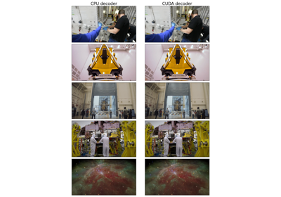
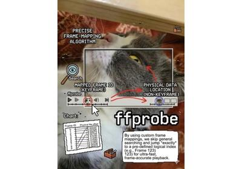

# Decoding

[Decoding a video with VideoDecoder](basic_example.html)

Decoding a video with VideoDecoder

[Decoding audio streams with AudioDecoder](audio_decoding.html)

Decoding audio streams with AudioDecoder

[Accelerated video decoding on GPUs with CUDA and NVDEC](basic_cuda_example.html)

Accelerated video decoding on GPUs with CUDA and NVDEC

[Streaming data through file-like support](file_like.html)

Streaming data through file-like support

[Exact vs Approximate seek mode: Performance and accuracy comparison](approximate_mode.html)

Exact vs Approximate seek mode: Performance and accuracy comparison

[How to sample video clips](sampling.html)

How to sample video clips

[Parallel video decoding: multi-processing and multi-threading](parallel_decoding.html)

Parallel video decoding: multi-processing and multi-threading

[TorchCodec Performance Tips and Best Practices](performance_tips.html)

TorchCodec Performance Tips and Best Practices

[Decoding with custom frame mappings](custom_frame_mappings.html)

Decoding with custom frame mappings

[Decoder Transforms: Applying transforms during decoding](transforms.html)

Decoder Transforms: Applying transforms during decoding