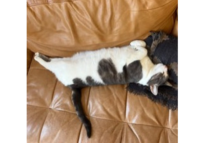

# decode_avif

torchcodec.decoders.decode_avif(*source: [str](https://docs.python.org/3/library/stdtypes.html#str) | [Path](https://docs.python.org/3/library/pathlib.html#pathlib.Path) | [bytes](https://docs.python.org/3/library/stdtypes.html#bytes) | [Tensor](https://docs.pytorch.org/docs/stable/tensors.html#torch.Tensor)*, ***, *mode: [Literal](https://docs.python.org/3/library/typing.html#typing.Literal)['UNCHANGED', 'GRAY', 'GRAY_ALPHA', 'RGB', 'RGB_ALPHA'] | [ImageReadMode](torchcodec.decoders.ImageReadMode.html#torchcodec.decoders.ImageReadMode) = 'RGB'*, *output_dtype: [dtype](https://docs.pytorch.org/docs/stable/tensor_attributes.html#torch.dtype) | [Literal](https://docs.python.org/3/library/typing.html#typing.Literal)['auto'] = torch.uint8*, *num_threads: [int](https://docs.python.org/3/library/functions.html#int) = 1*) → [Tensor](https://docs.pytorch.org/docs/stable/tensors.html#torch.Tensor)[[source]](../_modules/torchcodec/decoders/_image_decoders.html#decode_avif)

Decode an AVIF image into a `[N]CHW` tensor.

The output shape is `(C, H, W)` for a still AVIF and `(N, C, H, W)` for
an animated one (N frames).

Example

```
from torchcodec.decoders import decode_avif

img = decode_avif("image.avif")
```

Parameters:

- **source** (str, `pathlib.Path`, bytes, or `torch.Tensor`) - The encoded AVIF data: a path (`str` or `pathlib.Path`), a
`bytes` object, or a 1-D uint8 `torch.Tensor` of the raw encoded
bytes.
- **mode** ([*str*](https://docs.python.org/3/library/stdtypes.html#str)*or*[*ImageReadMode*](torchcodec.decoders.ImageReadMode.html#torchcodec.decoders.ImageReadMode)*,**optional*) - Desired color mode of the output
image. Can be one of `"UNCHANGED"`, `"GRAY"`, `"GRAY_ALPHA"`,
`"RGB"`, or `"RGB_ALPHA"`. Default is `"RGB"`.
- **output_dtype** (torch.dtype or `"auto"`, optional) - desired dtype of the
output image tensor. Accepted values are `torch.uint8` (default),
`torch.uint16`, and `"auto"`. AVIF can store more than 8 bits per
channel (e.g. 10- or 12-bit sources). `torch.uint16` always scales
the samples up to fill the full 16-bit range `[0, 65535]` (8-bit
0-255, 10-bit 0-1023 and 12-bit 0-4095 sources are all upscaled),
while `torch.uint8` scales higher-bit sources down. `"auto"`
yields uint8 for 8-bit AVIFs and uint16 (again filling `[0, 65535]`)
for higher-bit ones.
- **num_threads** ([*int*](https://docs.python.org/3/library/functions.html#int)*,**optional*) - Number of threads to use for decoding,
directly passed to libavif. Default is 1.

Returns:

The decoded image, of shape `(C, H, W)` (still) or
`(N, C, H, W)` (animated).

Return type:

[torch.Tensor](https://docs.pytorch.org/docs/stable/tensors.html#torch.Tensor)

Examples using `decode_avif`:



[Decoding images](../generated_examples/decoding/image_decoding.html)

Decoding images