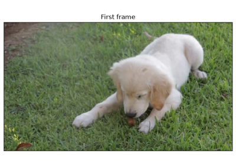

# Frame

*class*torchcodec.Frame(*data: [Tensor](https://docs.pytorch.org/docs/stable/tensors.html#torch.Tensor)*, *pts_seconds: [float](https://docs.python.org/3/builtins/functions.html#float)*, *duration_seconds: [float](https://docs.python.org/3/builtins/functions.html#float)*)[[source]](../_modules/torchcodec/_frame.html#Frame)

A single video frame with associated metadata.

Examples using `Frame`:

[Decoding a video with VideoDecoder](../generated_examples/decoding/basic_example.html)

Decoding a video with VideoDecoder

[Build your own decoding pipeline](../generated_examples/low_level/basics.html)

Build your own decoding pipeline

[Multi-threaded decoding pipelines](../generated_examples/low_level/pipelines.html)

Multi-threaded decoding pipelines

data*: [Tensor](https://docs.pytorch.org/docs/stable/tensors.html#torch.Tensor)*

The frame data as (3-D `torch.Tensor`).

duration_seconds*: [float](https://docs.python.org/3/builtins/functions.html#float)*

The duration of the frame, in seconds (float).

pts_seconds*: [float](https://docs.python.org/3/builtins/functions.html#float)*

The [pts](../glossary.html#term-pts) of the frame, in seconds (float).