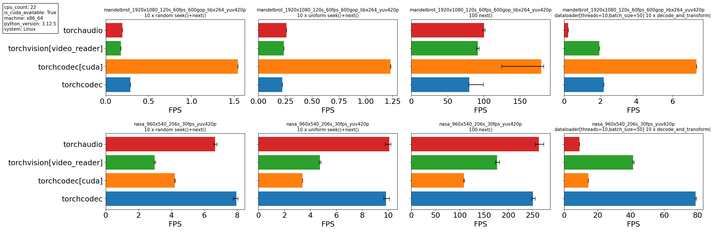

[**Installation**](#installing-torchcodec) | [**Simple Example**](#using-torchcodec) | [**Detailed Example**](https://meta-pytorch.org/torchcodec/stable/generated_examples/) | [**Documentation**](https://meta-pytorch.org/torchcodec) | [**Contributing**](CONTRIBUTING.md) | [**License**](#license)

# TorchCodec

TorchCodec is a Python library for decoding video and audio data into PyTorch
tensors, on CPU and CUDA GPU. It also supports video and audio encoding on CPU!
It aims to be fast, easy to use, and well integrated
into the PyTorch ecosystem.  If you want to use PyTorch to train ML models on
videos and audio, TorchCodec is how you turn these into data.

We achieve these capabilities through:

* Pythonic APIs that mirror Python and PyTorch conventions.
* Relying on [FFmpeg](https://www.ffmpeg.org/) to do the decoding and encoding.
  TorchCodec uses the version of FFmpeg you already have installed. FFmpeg is a
  mature library with broad coverage available on most systems. It is, however,
  not easy to use. TorchCodec abstracts FFmpeg's complexity to ensure it is used
  correctly and efficiently.
* Returning data as PyTorch tensors, ready to be fed into PyTorch transforms
  or used directly to train models.

## Using TorchCodec

Here's a condensed summary of what you can do with TorchCodec. For more detailed
examples, [check out our
documentation](https://meta-pytorch.org/torchcodec/stable/generated_examples/)!

#### Decoding

```python
from torchcodec.decoders import VideoDecoder

device = "cpu"  # or e.g. "cuda" !
decoder = VideoDecoder("path/to/video.mp4", device=device)

decoder.metadata
# VideoStreamMetadata:
#   num_frames: 250
#   duration_seconds: 10.0
#   bit_rate: 31315.0
#   codec: h264
#   average_fps: 25.0
#   ... (truncated output)

# Simple Indexing API
decoder[0]  # uint8 tensor of shape [C, H, W]
decoder[0 : -1 : 20]  # uint8 stacked tensor of shape [N, C, H, W]

# Indexing, with PTS and duration info:
decoder.get_frames_at(indices=[2, 100])
# FrameBatch:
#   data (shape): torch.Size([2, 3, 270, 480])
#   pts_seconds: tensor([0.0667, 3.3367], dtype=torch.float64)
#   duration_seconds: tensor([0.0334, 0.0334], dtype=torch.float64)

# Time-based indexing with PTS and duration info
decoder.get_frames_played_at(seconds=[0.5, 10.4])
# FrameBatch:
#   data (shape): torch.Size([2, 3, 270, 480])
#   pts_seconds: tensor([ 0.4671, 10.3770], dtype=torch.float64)
#   duration_seconds: tensor([0.0334, 0.0334], dtype=torch.float64)
```

#### Clip sampling

```python

from torchcodec.samplers import clips_at_regular_timestamps

clips_at_regular_timestamps(
    decoder,
    seconds_between_clip_starts=1.5,
    num_frames_per_clip=4,
    seconds_between_frames=0.1
)
# FrameBatch:
#   data (shape): torch.Size([9, 4, 3, 270, 480])
#   pts_seconds: tensor([[ 0.0000,  0.0667,  0.1668,  0.2669],
#         [ 1.4681,  1.5682,  1.6683,  1.7684],
#         [ 2.9696,  3.0697,  3.1698,  3.2699],
#         ... (truncated), dtype=torch.float64)
#   duration_seconds: tensor([[0.0334, 0.0334, 0.0334, 0.0334],
#         [0.0334, 0.0334, 0.0334, 0.0334],
#         [0.0334, 0.0334, 0.0334, 0.0334],
#         ... (truncated), dtype=torch.float64)
```

You can use the following snippet to generate a video with FFmpeg and tryout
TorchCodec:

```bash
fontfile=/usr/share/fonts/dejavu-sans-mono-fonts/DejaVuSansMono-Bold.ttf
output_video_file=/tmp/output_video.mp4

ffmpeg -f lavfi -i \
    color=size=640x400:duration=10:rate=25:color=blue \
    -vf "drawtext=fontfile=${fontfile}:fontsize=30:fontcolor=white:x=(w-text_w)/2:y=(h-text_h)/2:text='Frame %{frame_num}'" \
    ${output_video_file}
```

## Installing TorchCodec

1. Install FFmpeg, if it's not already installed. TorchCodec supports all major
   FFmpeg versions in [4, 8]. Linux distributions usually come with FFmpeg
   pre-installed. You'll need FFmpeg that comes with separate shared libraries.
   This is especially relevant for Windows users: these are usually called the
   "shared" releases.

   If FFmpeg is not already installed, or you need a more recent version, an
   easy way to install it is to use `conda`:

   ```bash
   conda install "ffmpeg"
   # or
   conda install "ffmpeg" -c conda-forge
   ```

2. Install PyTorch and TorchCodec:

   ```bash
   pip install torch torchcodec
   ```

   That's it! On Linux and Windows, this will install CUDA-enabled wheels by
   default (matching the default behavior of `pip install torch`). These wheels
   should *still* work even if you do not have a GPU on your machine. On macOS,
   this will install CPU-only wheels. CPU wheels are available for Linux (x86_64
   and aarch64), macOS, and Windows.

   For other versions of PyTorch, refer to the compatibility table below.

### CUDA support

CUDA-enabled wheels are installed by default on Linux and Windows (see above).
Make sure you have a GPU with NVDEC hardware that can decode the format you
want. Refer to Nvidia's GPU support matrix
[here](https://developer.nvidia.com/video-encode-and-decode-gpu-support-matrix-new).

You will need the `libnpp` and `libnvrtc` CUDA libraries, which are usually
part of the CUDA Toolkit.

To select a specific CUDA Toolkit version, use `--index-url`. Make sure to
install the corresponding PyTorch version as well (refer to the
[official instructions](https://pytorch.org/get-started/locally/)):

```bash
# This corresponds to CUDA Toolkit version 13.0.
pip install torch torchcodec --index-url=https://download.pytorch.org/whl/cu130
```

Make sure your FFmpeg has NVDEC support:

```bash
ffmpeg -decoders | grep -i nvidia
# This should show a line like this:
# V..... h264_cuvid           Nvidia CUVID H264 decoder (codec h264)
```

To check that FFmpeg libraries work with NVDEC correctly you can decode a
generated test video:

```bash
ffmpeg -hwaccel cuda -hwaccel_output_format cuda -f lavfi -i testsrc2=duration=1 -f null -
```

### CPU-only installation

To install CPU-only wheels explicitly (e.g. on Linux where CUDA wheels are the
default):

```bash
pip install torchcodec --index-url=https://download.pytorch.org/whl/cpu
```

### Compatibility

The following table indicates the compatibility between versions of
`torchcodec`, `torch` and Python.

| `torchcodec`       | `torch`            | Python              |
| ------------------ | ------------------ | ------------------- |
| `main` / `nightly` | `main` / `nightly` | `>=3.10`, `<=3.14`   |
| `0.12`             | `>=2.11`             | `>=3.10`, `<=3.14`   |
| `0.11`             | `2.11`             | `>=3.10`, `<=3.14`   |
| `0.10`             | `2.10`             | `>=3.10`, `<=3.14`   |

<details>
    <summary>older versions</summary>

| `torchcodec`       | `torch`            | Python              |
| ------------------ | ------------------ | ------------------- |
| `0.9`              | `2.9`              | `>=3.10`, `<=3.14`   |
| `0.8`              | `2.9`              | `>=3.10`, `<=3.13`   |
| `0.7`              | `2.8`              | `>=3.9`, `<=3.13`   |
| `0.6`              | `2.8`              | `>=3.9`, `<=3.13`   |
| `0.5`              | `2.7`              | `>=3.9`, `<=3.13`   |
| `0.4`              | `2.7`              | `>=3.9`, `<=3.13`   |
| `0.3`              | `2.7`              | `>=3.9`, `<=3.13`   |
| `0.2`              | `2.6`              | `>=3.9`, `<=3.13`   |
| `0.1`              | `2.5`              | `>=3.9`, `<=3.12`   |
| `0.0.3`            | `2.4`              | `>=3.8`, `<=3.12`   |

</details>

## Benchmark Results

The following was generated by running [our benchmark script](./benchmarks/decoders/generate_readme_data.py) on a lightly loaded 22-core machine with an Nvidia A100 with
5 [NVDEC decoders](https://docs.nvidia.com/video-technologies/video-codec-sdk/12.1/nvdec-application-note/index.html#).



The top row is a [Mandelbrot](https://ffmpeg.org/ffmpeg-filters.html#mandelbrot) video
generated from FFmpeg that has a resolution of 1280x720 at 60 fps and is 120 seconds long.
The bottom row is [promotional video from NASA](https://download.pytorch.org/torchaudio/tutorial-assets/stream-api/NASAs_Most_Scientifically_Complex_Space_Observatory_Requires_Precision-MP4_small.mp4)
that has a resolution of 960x540 at 29.7 fps and is 206 seconds long. Both videos were
encoded with libx264 and yuv420p pixel format. All decoders, except for TorchVision, used FFmpeg 6.1.2. TorchVision used FFmpeg 4.2.2.

For TorchCodec, the "approx" label means that it was using [approximate mode](https://meta-pytorch.org/torchcodec/stable/generated_examples/decoding/approximate_mode.html)
for seeking.

## Contributing

We welcome contributions to TorchCodec! Please see our [contributing
guide](CONTRIBUTING.md) for more details.

## License

TorchCodec is released under the [BSD 3 license](./LICENSE).

However, TorchCodec may be used with code not written by Meta which may be
distributed under different licenses.

For example, if you build TorchCodec with ENABLE_CUDA=1 or use the CUDA-enabled
release of torchcodec, please review CUDA's license here:
[Nvidia licenses](https://docs.nvidia.com/cuda/eula/index.html).
