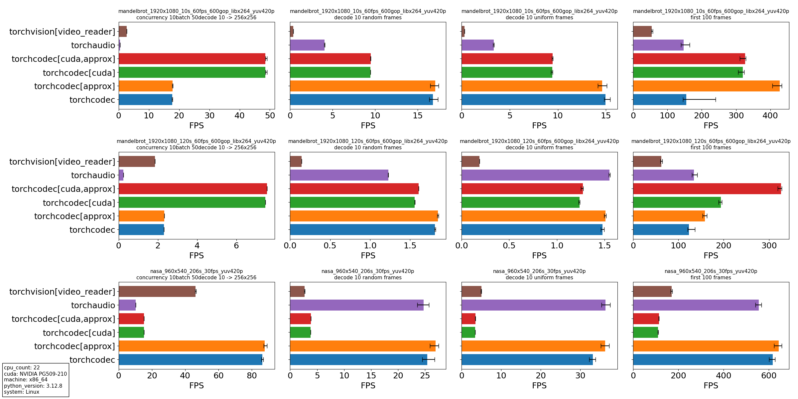

[**Installation**](#installing-torchcodec) | [**Simple Example**](#using-torchcodec) | [**Detailed Example**](https://pytorch.org/torchcodec/stable/generated_examples/) | [**Documentation**](https://pytorch.org/torchcodec) | [**Contributing**](CONTRIBUTING.md) | [**License**](#license)

# TorchCodec

TorchCodec is a Python library for decoding videos into PyTorch tensors. It aims
to be fast, easy to use, and well integrated into the PyTorch ecosystem. If you
want to use PyTorch to train ML models on videos, TorchCodec is how you turn
those videos into data.

We achieve these capabilities through:

* Pythonic APIs that mirror Python and PyTorch conventions.
* Relying on [FFmpeg](https://www.ffmpeg.org/) to do the decoding. TorchCodec
  uses the version of FFmpeg you already have installed. FFmpeg is a mature
  library with broad coverage available on most systems. It is, however, not
  easy to use. TorchCodec abstracts FFmpeg's complexity to ensure it is used
  correctly and efficiently.
* Returning data as PyTorch tensors, ready to be fed into PyTorch transforms
  or used directly to train models.

> [!NOTE]
> ⚠️ TorchCodec is still in early development stage and some APIs may be updated
> in future versions without a deprecation cycle, depending on user feedback.
> If you have any suggestions or issues, please let us know by
> [opening an issue](https://github.com/pytorch/torchcodec/issues/new/choose)!

## Using TorchCodec

Here's a condensed summary of what you can do with TorchCodec. For a more
detailed example, [check out our
documentation](https://pytorch.org/torchcodec/stable/generated_examples/)!

```python
from torchcodec.decoders import VideoDecoder

decoder = VideoDecoder("path/to/video.mp4")

decoder.metadata
# VideoStreamMetadata:
#   num_frames: 250
#   duration_seconds: 10.0
#   bit_rate: 31315.0
#   codec: h264
#   average_fps: 25.0
#   ... (truncated output)

len(decoder)  # == decoder.metadata.num_frames!
# 250
decoder.metadata.average_fps  # Note: instantaneous fps can be higher or lower
# 25.0

# Simple Indexing API
decoder[0]  # uint8 tensor of shape [C, H, W]
decoder[0 : -1 : 20]  # uint8 stacked tensor of shape [N, C, H, W]


# Iterate over frames:
for frame in decoder:
    pass

# Indexing, with PTS and duration info
decoder.get_frame_at(len(decoder) - 1)
# Frame:
#   data (shape): torch.Size([3, 400, 640])
#   pts_seconds: 9.960000038146973
#   duration_seconds: 0.03999999910593033

decoder.get_frames_in_range(start=10, stop=30, step=5)
# FrameBatch:
#   data (shape): torch.Size([4, 3, 400, 640])
#   pts_seconds: tensor([0.4000, 0.6000, 0.8000, 1.0000])
#   duration_seconds: tensor([0.0400, 0.0400, 0.0400, 0.0400])

# Time-based indexing with PTS and duration info
decoder.get_frame_played_at(pts_seconds=2)
# Frame:
#   data (shape): torch.Size([3, 400, 640])
#   pts_seconds: 2.0
#   duration_seconds: 0.03999999910593033
```

You can use the following snippet to generate a video with FFmpeg and tryout
TorchCodec:

```bash
fontfile=/usr/share/fonts/dejavu-sans-mono-fonts/DejaVuSansMono-Bold.ttf
output_video_file=/tmp/output_video.mp4

ffmpeg -f lavfi -i \
    color=size=640x400:duration=10:rate=25:color=blue \
    -vf "drawtext=fontfile=${fontfile}:fontsize=30:fontcolor=white:x=(w-text_w)/2:y=(h-text_h)/2:text='Frame %{frame_num}'" \
    ${output_video_file}
```

## Installing TorchCodec
### Installing CPU-only TorchCodec

1. Install the latest stable version of PyTorch following the
   [official instructions](https://pytorch.org/get-started/locally/). For other
   versions, refer to the table below for compatibility between versions of
   `torch` and `torchcodec`.

2. Install FFmpeg, if it's not already installed. Linux distributions usually
   come with FFmpeg pre-installed. TorchCodec supports all major FFmpeg versions
   in [4, 7].

   If FFmpeg is not already installed, or you need a more recent version, an
   easy way to install it is to use `conda`:

   ```bash
   conda install ffmpeg
   # or
   conda install ffmpeg -c conda-forge
   ```

3. Install TorchCodec:

   ```bash
   pip install torchcodec
   ```

The following table indicates the compatibility between versions of
`torchcodec`, `torch` and Python.

| `torchcodec`       | `torch`            | Python              |
| ------------------ | ------------------ | ------------------- |
| `main` / `nightly` | `main` / `nightly` | `>=3.9`, `<=3.12`   |
| not yet supported  | `2.5`              | `>=3.9`, `<=3.12`   |
| `0.0.3`            | `2.4`              | `>=3.8`, `<=3.12`   |

### Installing CUDA-enabled TorchCodec

First, make sure you have a GPU that has NVDEC hardware that can decode the
format you want. Refer to Nvidia's GPU support matrix for more details
[here](https://developer.nvidia.com/video-encode-and-decode-gpu-support-matrix-new).

1. Install CUDA Toolkit. Pytorch and TorchCodec supports CUDA Toolkit
   versions 11.8, 12.1 or 12.4. In particular TorchCodec depends on
   CUDA libraries libnpp and libnvrtc (which are part of CUDA Toolkit).

2. Install Pytorch that corresponds to your CUDA Toolkit version using the
   [official instructions](https://pytorch.org/get-started/locally/).

3. Install or compile FFmpeg with NVDEC support.
   TorchCodec with CUDA should work with FFmpeg versions in [4, 7].

   If FFmpeg is not already installed, or you need a more recent version, an
   easy way to install it is to use `conda`:

   ```bash
   conda install ffmpeg
   # or
   conda install ffmpeg -c conda-forge
   ```

   If you are building FFmpeg from source you can follow Nvidia's guide to
   configuring and installing FFmpeg with NVDEC support
   [here](https://docs.nvidia.com/video-technologies/video-codec-sdk/12.0/ffmpeg-with-nvidia-gpu/index.html).

   After installing FFmpeg make sure it has NVDEC support when you list the supported
   decoders:

   ```bash
   ffmpeg -decoders | grep -i nvidia
   # This should show a line like this:
   # V..... h264_cuvid           Nvidia CUVID H264 decoder (codec h264)
   ```

   To check that FFmpeg libraries work with NVDEC correctly you can decode a sample video:

   ```bash
   ffmpeg -hwaccel cuda -hwaccel_output_format cuda -i test/resources/nasa_13013.mp4 -f null -
   ```

4. Install TorchCodec by passing in an `--index-url` parameter that corresponds to your CUDA
   Toolkit version, example:

   ```bash
   # This corresponds to CUDA Toolkit version 12.4
   pip install torchcodec --index-url=https://download.pytorch.org/whl/nightly/cu124
   ```

   Note that without passing in the `--index-url` parameter, `pip` installs TorchCodec
   binaries from PyPi which are CPU-only and do not have CUDA support.

## Benchmark Results

The following was generated by running [our benchmark script](./benchmarks/decoders/generate_readme_data.py) on a lightly loaded 56-core machine.



The top row is a [Mandelbrot](https://ffmpeg.org/ffmpeg-filters.html#mandelbrot) video
generated from FFmpeg that has a resolution of 1280x720 at 60 fps and is 120 seconds long.
The bottom row is [promotional video from NASA](https://download.pytorch.org/torchaudio/tutorial-assets/stream-api/NASAs_Most_Scientifically_Complex_Space_Observatory_Requires_Precision-MP4_small.mp4)
that has a resolution of 960x540 at 29.7 fps and is 206 seconds long. Both videos were
encoded with libx264 and yuv420p pixel format.

## Planned future work

We are actively working on the following features:

- [Audio decoding](https://github.com/pytorch/torchcodec/issues/85)

Let us know if you have any feature requests by [opening an
issue](https://github.com/pytorch/torchcodec/issues/new?assignees=&labels=&projects=&template=feature-request.yml)!

## Contributing

We welcome contributions to TorchCodec! Please see our [contributing
guide](CONTRIBUTING.md) for more details.

## License

TorchCodec is released under the [BSD 3 license](./LICENSE).
