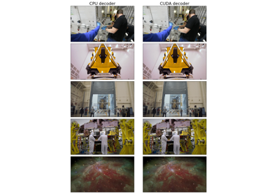
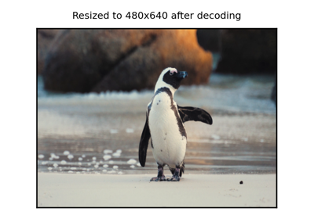

# VideoDecoder

*class*torchcodec.decoders.VideoDecoder(*source: [str](https://docs.python.org/3/library/stdtypes.html#str) | [Path](https://docs.python.org/3/library/pathlib.html#pathlib.Path) | [RawIOBase](https://docs.python.org/3/library/io.html#io.RawIOBase) | BufferedReader | [bytes](https://docs.python.org/3/library/stdtypes.html#bytes) | [Tensor](https://docs.pytorch.org/docs/stable/tensors.html#torch.Tensor)*, ***, *stream_index: [int](https://docs.python.org/3/library/functions.html#int) | [None](https://docs.python.org/3/library/constants.html#None) = None*, *dimension_order: [Literal](https://docs.python.org/3/library/typing.html#typing.Literal)['NCHW', 'NHWC'] = 'NCHW'*, *num_ffmpeg_threads: [int](https://docs.python.org/3/library/functions.html#int) = 1*, *device: [str](https://docs.python.org/3/library/stdtypes.html#str) | [device](https://docs.pytorch.org/docs/stable/tensor_attributes.html#torch.device) | [None](https://docs.python.org/3/library/constants.html#None) = None*, *seek_mode: [Literal](https://docs.python.org/3/library/typing.html#typing.Literal)['exact', 'approximate'] = 'exact'*, *transforms: [Sequence](https://docs.python.org/3/library/collections.abc.html#collections.abc.Sequence)[[DecoderTransform](torchcodec.transforms.DecoderTransform.html#torchcodec.transforms.DecoderTransform) | [Module](https://docs.pytorch.org/docs/stable/generated/torch.nn.Module.html#torch.nn.Module)] | [None](https://docs.python.org/3/library/constants.html#None) = None*, *custom_frame_mappings: [str](https://docs.python.org/3/library/stdtypes.html#str) | [bytes](https://docs.python.org/3/library/stdtypes.html#bytes) | [RawIOBase](https://docs.python.org/3/library/io.html#io.RawIOBase) | BufferedReader | [None](https://docs.python.org/3/library/constants.html#None) = None*)[[source]](../_modules/torchcodec/decoders/_video_decoder.html#VideoDecoder)

A single-stream video decoder.

Parameters:

- **source** (str, `Pathlib.path`, bytes, `torch.Tensor` or file-like object) - 

The source of the video:

- If `str`: a local path or a URL to a video file.
- If `Pathlib.path`: a path to a local video file.
- If `bytes` object or `torch.Tensor`: the raw encoded video data.
- If file-like object: we read video data from the object on demand. The object must
expose the methods read(self, size: int) -> bytes and
seek(self, offset: int, whence: int) -> int. Read more in:
[Streaming data through file-like support](../generated_examples/decoding/file_like.html#sphx-glr-generated-examples-decoding-file-like-py).
- **stream_index** ([*int*](https://docs.python.org/3/library/functions.html#int)*,**optional*) - Specifies which stream in the video to decode frames from.
Note that this index is absolute across all media types. If left unspecified, then
the [best stream](../glossary.html#term-best-stream) is used.
- **dimension_order** ([*str*](https://docs.python.org/3/library/stdtypes.html#str)*,**optional*) - 

The dimension order of the decoded frames.
This can be either "NCHW" (default) or "NHWC", where N is the batch
size, C is the number of channels, H is the height, and W is the
width of the frames.

Note

Frames are natively decoded in NHWC format by the underlying
FFmpeg implementation. Converting those into NCHW format is a
cheap no-copy operation that allows these frames to be
transformed using the [torchvision transforms](https://pytorch.org/vision/stable/transforms.html).
- **num_ffmpeg_threads** ([*int*](https://docs.python.org/3/library/functions.html#int)*,**optional*) - The number of threads to use for CPU decoding.
This has no effect when using GPU decoding.
Use 1 for single-threaded decoding which may be best if you are running multiple
instances of `VideoDecoder` in parallel. Use a higher number for multi-threaded
decoding which is best if you are running a single instance of `VideoDecoder`.
Passing 0 lets FFmpeg decide on the number of threads.
Default: 1.
- **device** ([*str*](https://docs.python.org/3/library/stdtypes.html#str)*or*[*torch.device*](https://docs.pytorch.org/docs/stable/tensor_attributes.html#torch.device)*,**optional*) - The device to use for decoding.
If `None` (default), uses the current default device.
If you pass a CUDA device, we recommend trying the "beta" CUDA
backend which is faster! See [`set_cuda_backend()`](torchcodec.decoders.set_cuda_backend.html#torchcodec.decoders.set_cuda_backend).
- **seek_mode** ([*str*](https://docs.python.org/3/library/stdtypes.html#str)*,**optional*) - Determines if frame access will be "exact" or
"approximate". Exact guarantees that requesting frame i will always
return frame i, but doing so requires an initial [scan](../glossary.html#term-scan) of the
file. Approximate is faster as it avoids scanning the file, but less
accurate as it uses the file's metadata to calculate where i
probably is. Default: "exact".
Read more about this parameter in:
[Exact vs Approximate seek mode: Performance and accuracy comparison](../generated_examples/decoding/approximate_mode.html#sphx-glr-generated-examples-decoding-approximate-mode-py)
- **transforms** (*sequence**of**transform objects**,**optional*) - Sequence of transforms to be
applied to the decoded frames by the decoder itself, in order. Accepts both
[`DecoderTransform`](torchcodec.transforms.DecoderTransform.html#torchcodec.transforms.DecoderTransform) and
[`Transform`](https://docs.pytorch.org/vision/stable/generated/torchvision.transforms.v2.Transform.html#torchvision.transforms.v2.Transform)
objects. Read more about this parameter in: TODO_DECODER_TRANSFORMS_TUTORIAL.
- **custom_frame_mappings** ([*str*](https://docs.python.org/3/library/stdtypes.html#str)*,*[*bytes*](https://docs.python.org/3/library/stdtypes.html#bytes)*, or**file-like object**,**optional*) - 

Mapping of frames to their metadata, typically generated via ffprobe.
This enables accurate frame seeking without requiring a full video scan.
Do not set seek_mode when custom_frame_mappings is provided.
Expected JSON format:

```
{
 "frames": [
 {
 "pts": 0,
 "duration": 1001,
 "key_frame": 1
 }
 ]
}
```

Alternative field names "pkt_pts" and "pkt_duration" are also supported.
Read more about this parameter in:
[Decoding with custom frame mappings](../generated_examples/decoding/custom_frame_mappings.html#sphx-glr-generated-examples-decoding-custom-frame-mappings-py)

Variables:

- **metadata** ([*VideoStreamMetadata*](torchcodec.decoders.VideoStreamMetadata.html#torchcodec.decoders.VideoStreamMetadata)) - Metadata of the video stream.
- **stream_index** ([*int*](https://docs.python.org/3/library/functions.html#int)) - The stream index that this decoder is retrieving frames from. If a
stream index was provided at initialization, this is the same value. If it was left
unspecified, this is the [best stream](../glossary.html#term-best-stream).
- **cpu_fallback** ([*CpuFallbackStatus*](torchcodec.decoders.CpuFallbackStatus.html#torchcodec.decoders.CpuFallbackStatus)) - Information about whether the decoder fell back to CPU
decoding. Use `bool(cpu_fallback)` to check if fallback occurred, or
`str(cpu_fallback)` to get a human-readable status message. The status is only
determined after at least one frame has been decoded.

Examples using `VideoDecoder`:


[Exact vs Approximate seek mode: Performance and accuracy comparison](../generated_examples/decoding/approximate_mode.html)

Exact vs Approximate seek mode: Performance and accuracy comparison


[Accelerated video decoding on GPUs with CUDA and NVDEC](../generated_examples/decoding/basic_cuda_example.html)

Accelerated video decoding on GPUs with CUDA and NVDEC


[Decoding a video with VideoDecoder](../generated_examples/decoding/basic_example.html)

Decoding a video with VideoDecoder


[Decoding with custom frame mappings](../generated_examples/decoding/custom_frame_mappings.html)

Decoding with custom frame mappings


[Streaming data through file-like support](../generated_examples/decoding/file_like.html)

Streaming data through file-like support


[Parallel video decoding: multi-processing and multi-threading](../generated_examples/decoding/parallel_decoding.html)

Parallel video decoding: multi-processing and multi-threading


[TorchCodec Performance Tips and Best Practices](../generated_examples/decoding/performance_tips.html)

TorchCodec Performance Tips and Best Practices


[How to sample video clips](../generated_examples/decoding/sampling.html)

How to sample video clips


[Decoder Transforms: Applying transforms during decoding](../generated_examples/decoding/transforms.html)

Decoder Transforms: Applying transforms during decoding


[Encoding video frames with VideoEncoder](../generated_examples/encoding/video_encoding.html)

Encoding video frames with VideoEncoder

__getitem__(*key: [Integral](https://docs.python.org/3/library/numbers.html#numbers.Integral) | [slice](https://docs.python.org/3/library/functions.html#slice)*) → [Tensor](https://docs.pytorch.org/docs/stable/tensors.html#torch.Tensor)[[source]](../_modules/torchcodec/decoders/_video_decoder.html#VideoDecoder.__getitem__)

Return frame or frames as tensors, at the given index or range.

Note

If you need to decode multiple frames, we recommend using the batch
methods instead, since they are faster:
`get_frames_at()`,
`get_frames_in_range()`,
`get_frames_played_at()`, and
`get_frames_played_in_range()`.

Parameters:

**key** ([*int*](https://docs.python.org/3/library/functions.html#int)*or*[*slice*](https://docs.python.org/3/library/functions.html#slice)) - The index or range of frame(s) to retrieve.

Returns:

The frame or frames at the given index or range.

Return type:

[torch.Tensor](https://docs.pytorch.org/docs/stable/tensors.html#torch.Tensor)

get_all_frames(*fps: [float](https://docs.python.org/3/library/functions.html#float) | [None](https://docs.python.org/3/library/constants.html#None) = None*) → [FrameBatch](torchcodec.FrameBatch.html#torchcodec.FrameBatch)[[source]](../_modules/torchcodec/decoders/_video_decoder.html#VideoDecoder.get_all_frames)

Returns all frames in the video.

Parameters:

**fps** ([*float*](https://docs.python.org/3/library/functions.html#float)*,**optional*) - If specified, resample output to this frame
rate by duplicating or dropping frames as necessary. If None
(default), returns frames at the source video's frame rate.

Returns:

All frames in the video.

Return type:

[FrameBatch](torchcodec.FrameBatch.html#torchcodec.FrameBatch)

get_frame_at(*index: [int](https://docs.python.org/3/library/functions.html#int)*) → [Frame](torchcodec.Frame.html#torchcodec.Frame)[[source]](../_modules/torchcodec/decoders/_video_decoder.html#VideoDecoder.get_frame_at)

Return a single frame at the given index.

Note

If you need to decode multiple frames, we recommend using the batch
methods instead, since they are faster:
`get_frames_at()`,
`get_frames_in_range()`,
`get_frames_played_at()`,
`get_frames_played_in_range()`.

Parameters:

**index** ([*int*](https://docs.python.org/3/library/functions.html#int)) - The index of the frame to retrieve.

Returns:

The frame at the given index.

Return type:

[Frame](torchcodec.Frame.html#torchcodec.Frame)

get_frame_played_at(*seconds: [float](https://docs.python.org/3/library/functions.html#float)*) → [Frame](torchcodec.Frame.html#torchcodec.Frame)[[source]](../_modules/torchcodec/decoders/_video_decoder.html#VideoDecoder.get_frame_played_at)

Return a single frame played at the given timestamp in seconds.

Note

If you need to decode multiple frames, we recommend using the batch
methods instead, since they are faster:
`get_frames_at()`,
`get_frames_in_range()`,
`get_frames_played_at()`,
`get_frames_played_in_range()`.

Parameters:

**seconds** ([*float*](https://docs.python.org/3/library/functions.html#float)) - The time stamp in seconds when the frame is played.

Returns:

The frame that is played at `seconds`.

Return type:

[Frame](torchcodec.Frame.html#torchcodec.Frame)

get_frames_at(*indices: [Tensor](https://docs.pytorch.org/docs/stable/tensors.html#torch.Tensor) | [list](https://docs.python.org/3/library/stdtypes.html#list)[[int](https://docs.python.org/3/library/functions.html#int)]*) → [FrameBatch](torchcodec.FrameBatch.html#torchcodec.FrameBatch)[[source]](../_modules/torchcodec/decoders/_video_decoder.html#VideoDecoder.get_frames_at)

Return frames at the given indices.

Parameters:

**indices** ([*torch.Tensor*](https://docs.pytorch.org/docs/stable/tensors.html#torch.Tensor)*or*[*list*](https://docs.python.org/3/library/stdtypes.html#list)*of*[*int*](https://docs.python.org/3/library/functions.html#int)) - The indices of the frames to retrieve.

Returns:

The frames at the given indices.

Return type:

[FrameBatch](torchcodec.FrameBatch.html#torchcodec.FrameBatch)

get_frames_in_range(*start: [int](https://docs.python.org/3/library/functions.html#int)*, *stop: [int](https://docs.python.org/3/library/functions.html#int)*, *step: [int](https://docs.python.org/3/library/functions.html#int) = 1*) → [FrameBatch](torchcodec.FrameBatch.html#torchcodec.FrameBatch)[[source]](../_modules/torchcodec/decoders/_video_decoder.html#VideoDecoder.get_frames_in_range)

Return multiple frames at the given index range.

Frames are in [start, stop).

Parameters:

- **start** ([*int*](https://docs.python.org/3/library/functions.html#int)) - Index of the first frame to retrieve.
- **stop** ([*int*](https://docs.python.org/3/library/functions.html#int)) - End of indexing range (exclusive, as per Python
conventions).
- **step** ([*int*](https://docs.python.org/3/library/functions.html#int)*,**optional*) - Step size between frames. Default: 1.

Returns:

The frames within the specified range.

Return type:

[FrameBatch](torchcodec.FrameBatch.html#torchcodec.FrameBatch)

get_frames_played_at(*seconds: [Tensor](https://docs.pytorch.org/docs/stable/tensors.html#torch.Tensor) | [list](https://docs.python.org/3/library/stdtypes.html#list)[[float](https://docs.python.org/3/library/functions.html#float)]*) → [FrameBatch](torchcodec.FrameBatch.html#torchcodec.FrameBatch)[[source]](../_modules/torchcodec/decoders/_video_decoder.html#VideoDecoder.get_frames_played_at)

Return frames played at the given timestamps in seconds.

Parameters:

**seconds** ([*torch.Tensor*](https://docs.pytorch.org/docs/stable/tensors.html#torch.Tensor)*or*[*list*](https://docs.python.org/3/library/stdtypes.html#list)*of*[*float*](https://docs.python.org/3/library/functions.html#float)) - The timestamps in seconds when the frames are played.

Returns:

The frames that are played at `seconds`.

Return type:

[FrameBatch](torchcodec.FrameBatch.html#torchcodec.FrameBatch)

get_frames_played_in_range(*start_seconds: [float](https://docs.python.org/3/library/functions.html#float)*, *stop_seconds: [float](https://docs.python.org/3/library/functions.html#float)*, *fps: [float](https://docs.python.org/3/library/functions.html#float) | [None](https://docs.python.org/3/library/constants.html#None) = None*) → [FrameBatch](torchcodec.FrameBatch.html#torchcodec.FrameBatch)[[source]](../_modules/torchcodec/decoders/_video_decoder.html#VideoDecoder.get_frames_played_in_range)

Returns multiple frames in the given range.

Frames are in the half open range [start_seconds, stop_seconds). Each
returned frame's [pts](../glossary.html#term-pts), in seconds, is inside of the half open
range.

Parameters:

- **start_seconds** ([*float*](https://docs.python.org/3/library/functions.html#float)) - Time, in seconds, of the start of the range.
- **stop_seconds** ([*float*](https://docs.python.org/3/library/functions.html#float)) - Time, in seconds, of the end of the range.
As a half open range, the end is excluded.
- **fps** ([*float*](https://docs.python.org/3/library/functions.html#float)*,**optional*) - If specified, resample output to this frame
rate by duplicating or dropping frames as necessary. If None
(default), returns frames at the source video's frame rate.

Returns:

The frames within the specified range.

Return type:

[FrameBatch](torchcodec.FrameBatch.html#torchcodec.FrameBatch)