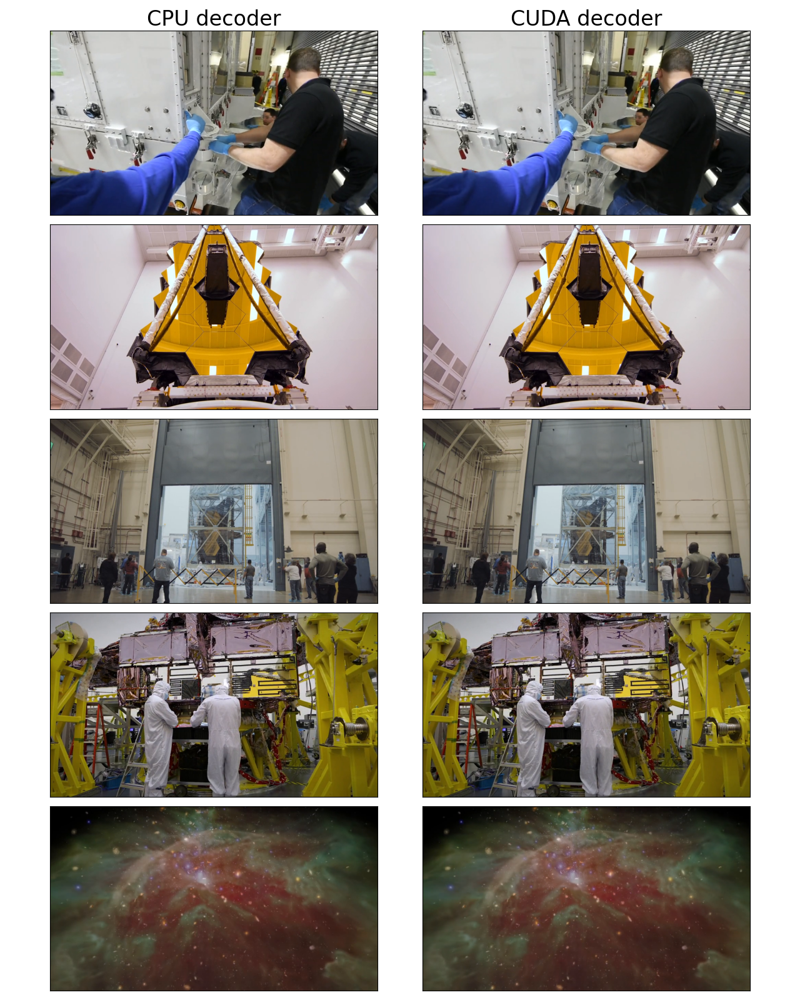

# Accelerated video decoding on GPUs with CUDA and NVDEC

TorchCodec can use supported Nvidia hardware (see support matrix
[here](https://developer.nvidia.com/video-encode-and-decode-gpu-support-matrix-new)) to speed-up
video decoding. This is called "CUDA Decoding" and it uses Nvidia's
[NVDEC hardware decoder](https://developer.nvidia.com/video-codec-sdk)
and CUDA kernels to respectively decompress and convert to RGB.
CUDA Decoding can be faster than CPU Decoding for the actual decoding step and also for
subsequent transform steps like scaling, cropping or rotating. This is because the decode step leaves
the decoded tensor in GPU memory so the GPU doesn't have to fetch from main memory before
running the transform steps. Encoded packets are often much smaller than decoded frames so
CUDA decoding also uses less PCI-e bandwidth.

## Installing TorchCodec with CUDA Enabled

Refer to the installation guide in the [README](https://github.com/meta-pytorch/torchcodec#installing-cuda-enabled-torchcodec).

## Checking if Pytorch has CUDA enabled

Note

This tutorial requires FFmpeg libraries compiled with CUDA support.

```
import torch

print(f"{torch.__version__=}")
print(f"{torch.cuda.is_available()=}")
print(f"{torch.cuda.get_device_properties(0)=}")
```

```
torch.__version__='2.13.0.dev20260424+cu126'
torch.cuda.is_available()=True
torch.cuda.get_device_properties(0)=_CudaDeviceProperties(name='NVIDIA A10G', major=8, minor=6, total_memory=22587MB, multi_processor_count=80, uuid=9d70676d-792b-5033-2c05-1377e6b460af, pci_bus_id=0, pci_device_id=30, pci_domain_id=0, L2_cache_size=6MB)
```

## Downloading the video

We will use the following video which has the following properties:

- Codec: H.264
- Resolution: 960x540
- FPS: 29.97
- Pixel format: YUV420P

```
import urllib.request

video_file = "video.mp4"
urllib.request.urlretrieve(
 "https://download.pytorch.org/torchaudio/tutorial-assets/stream-api/NASAs_Most_Scientifically_Complex_Space_Observatory_Requires_Precision-MP4_small.mp4",
 video_file,
)
```

```
('video.mp4', <http.client.HTTPMessage object at 0x7fb6f1f15450>)
```

## CUDA Decoding using VideoDecoder

To use CUDA decoder, you need to pass in a cuda device to the decoder.

```
from torchcodec.decoders import set_cuda_backend, VideoDecoder

with set_cuda_backend("beta"): # Use the BETA backend, it's faster!
 decoder = VideoDecoder(video_file, device="cuda")
frame = decoder[0]
```

The video frames are decoded and returned as tensor of NCHW format.

```
print(frame.shape, frame.dtype)
```

```
torch.Size([3, 540, 960]) torch.uint8
```

The video frames are left on the GPU memory.

```
print(frame.data.device)
```

```
cuda:0
```

## Checking for CPU Fallback

In some cases, CUDA decoding may fall back to CPU decoding. This can happen
when the video codec or format is not supported by the NVDEC hardware decoder, or when NVCUVID wasn't found.
TorchCodec provides the [`CpuFallbackStatus`](../../generated/torchcodec.decoders.CpuFallbackStatus.html#torchcodec.decoders.CpuFallbackStatus) class
to help you detect when this fallback occurs.

You can access the fallback status via the
`cpu_fallback` attribute:

```
with set_cuda_backend("beta"):
 decoder = VideoDecoder(video_file, device="cuda")

# Check and print the CPU fallback status
print(decoder.cpu_fallback)
```

```
[Beta CUDA] Fallback status: No fallback required
```

## Visualizing Frames

Let's look at the frames decoded by CUDA decoder and compare them
against equivalent results from the CPU decoders.

```
timestamps = [12, 19, 45, 131, 180]
cpu_decoder = VideoDecoder(video_file, device="cpu")
with set_cuda_backend("beta"):
 cuda_decoder = VideoDecoder(video_file, device="cuda")
cpu_frames = cpu_decoder.get_frames_played_at(timestamps).data
cuda_frames = cuda_decoder.get_frames_played_at(timestamps).data

def plot_cpu_and_cuda_frames(cpu_frames: torch.Tensor, cuda_frames: torch.Tensor):
 try:
 import matplotlib.pyplot as plt
 from torchvision.transforms.v2.functional import to_pil_image
 except ImportError:
 print("Cannot plot, please run `pip install torchvision matplotlib`")
 return
 n_rows = len(timestamps)
 fig, axes = plt.subplots(n_rows, 2, figsize=[12.8, 16.0])
 for i in range(n_rows):
 axes[i][0].imshow(to_pil_image(cpu_frames[i].to("cpu")))
 axes[i][1].imshow(to_pil_image(cuda_frames[i].to("cpu")))

 axes[0][0].set_title("CPU decoder", fontsize=24)
 axes[0][1].set_title("CUDA decoder", fontsize=24)
 plt.setp(axes, xticks=[], yticks=[])
 plt.tight_layout()

plot_cpu_and_cuda_frames(cpu_frames, cuda_frames)
```



They look visually similar to the human eye but there may be subtle
differences because CUDA math is not bit-exact with respect to CPU math.

```
frames_equal = torch.equal(cpu_frames.to("cuda"), cuda_frames)
mean_abs_diff = torch.mean(
 torch.abs(cpu_frames.float().to("cuda") - cuda_frames.float())
)
max_abs_diff = torch.max(torch.abs(cpu_frames.to("cuda").float() - cuda_frames.float()))
print(f"{frames_equal=}")
print(f"{mean_abs_diff=}")
print(f"{max_abs_diff=}")
```

```
frames_equal=False
mean_abs_diff=tensor(0.5636, device='cuda:0')
max_abs_diff=tensor(2., device='cuda:0')
```

**Total running time of the script:** (0 minutes 4.794 seconds)

[`Download Jupyter notebook: basic_cuda_example.ipynb`](../../_downloads/0d9d7e92cb34559510d86a36f73e1e53/basic_cuda_example.ipynb)

[`Download Python source code: basic_cuda_example.py`](../../_downloads/c7af961320da5fc563de74524e45acc5/basic_cuda_example.py)

[`Download zipped: basic_cuda_example.zip`](../../_downloads/91718060960d65062d778b1f1d484390/basic_cuda_example.zip)

[Gallery generated by Sphinx-Gallery](https://sphinx-gallery.github.io)